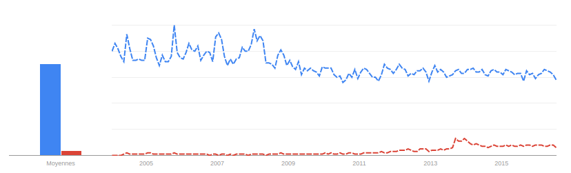
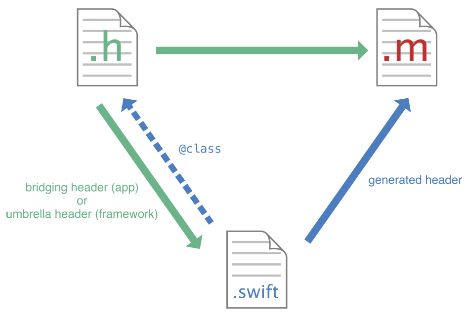

# Introduction

Dans le monde connecté d'aujourd'hui, l'information instantanée prend de l'ampleur à travers des vecteurs divers. Les différents réseaux sociaux soutiennent ce mouvement en incitant son public à partager du texte, des clichés ou encore de la vidéo. En effet, de nombreuses applications et sites web voient le jour chaque année. Parmi eux, les plus connus sont Twitch.tv: un site web de diffusion vidéo en direct utilisé surtout par les amateurs de jeu vidéo, Periscope: une application mobile permettant la diffusion en direct depuis la caméra du smartphone vers d'autres smartphones à travers le monde, et la majorité des grands acteurs du web ont ajouté cette fonctionnalité à leurs sites web: YouTube, Facebook, Snapchat, etc.

Ce phénomène contraint les médias "classiques" à continuer à s'adapter aux nouvelles technologies de communication. La diffusion d'information en direct prend alors une place de plus en plus importante afin d'atteindre ce nouveau public friand d'instantané. La RTS (Radio Télévision Suisse) fait partie de ces médias dont la popularité est en jeu. Il n'est donc pas étonnant qu'ils souhaitent aussi participer à l'expansion de cette nouvelle manière de partager l'information. Bien évidemment, les émissions et retransmissions d'événements en direct ne sont pas choses nouvelles pour une chaîne de télévision mais la différence réside aussi dans la manière de procéder. En effet, en ayant une application de diffusion en direct sur leurs téléphones, les journalistes ont la liberté de créer du contenu à tout moment et sans préparation. Cela peut être très pratique pour émettre les images d'un festival de musique, d'un incendie qui vient de débuter ou encore d'interviewer une personnalité que l'on croiserait par hasard.

C'est pourquoi la RTS a proposé à l'HEIG-VD un travail de Bachelor ayant pour sujet la création d'une application pour iPhone permettant la diffusion en direct des images perçue par sa caméra, enveloppée dans une interface donnant la possibilité aux journalistes d'ajouter des informations utiles concernant la capture. Ce travail a alors été effectué en collaboration avec la RTS qui a, par exemple, fourni le cahier des charges.

Ce projet est constitué de trois phases:

- une phase de recherche comprenant les différents protocoles de diffusion en direct ainsi que leurs formats audio et vidéo, les applications déjà existantes, des bibliothèques qui peuvent être utile au développement d'un tel projet, des possibilités qu'offrent iOS, etc.
- une phase de création de prototypes, permettant de vérifier la faisabilité du projets et l'exploration approfondie des bibliothèques susmentionnées. Cette phase fera aussi office de familiarisation avec le développement sur iOS et tout ce que cela comprend (apprentissage du langage de programmation Swift, maitrise du logiciel Xcode, etc.).
- une phase de création de l'application finale, reprenant les concepts et algorithmes des prototypes. C'est cette application qui sera livrée à la RTS.

Ce rapport explique en détail le travail qui a été effectué durant ces différentes phases, les problèmes qui sont apparus au cours du développement et les solutions qui ont été employées afin d'y remédier.  
Ainsi, la première partie explique en détails les buts et objectifs de ce travail selon les contraintes données par la RTS.  
La seconde partie expose les différentes technologies existantes et explore les avantages et inconvénients de chacune des méthodes de diffusion.  
La troisième partie documente le travail effectué sur l'application finale ainsi que son fonctionnement.
Pour terminer, des propositions d'amélioration seront exporées et discutées.


# État de l'art

La première partie du projet a consisté en la familiarisation avec les technologies susmentionnées, effectuer des recherches sur l'état de l'art ainsi que sur le futur de ces différents systèmes. En effet, ce genre d'application étant relativement moderne, il est utile d'essayer de prédire comment vont se développer les technologies de diffusion vidéo ainsi que leur support. Par exemple, l'abandon progressif des technologies Flash au profit d'HTML5 par les navigateurs constitue un paramètre non négligeable dans la création d'application de demain.

Cette section présente donc divers aspects factuels sur la diffusion de la vidéo en direct.

## Introduction sur les fichiers vidéo

Tout comme pour les images, les données vidéo sont compressés afin que leur stockage, leur transfert et leur lecture ne demande pas trop de ressources. Et comme pour les images, il existe une multitude d'algorithme de compression. De plus, les fichiers vidéo embarquent aussi souvent une bande son, donc, des données audio. Et à nouveau, les méthodes de compressions sont nombreuses.

### Conteneurs et encodeurs

Les fichiers vidéo sont alors organisés de la manière suivante: le fichier vidéo est un conteneur avec un format défini (AVI, MP4, MPEG, QuickTime, FLV, etc.). Ce conteneur va alors héberger les données vidéo qui seront compressés selon les encodeurs supportés par le format (H.264, MPEG-4, MPEG-2, AVC, etc.) et les données audio seront, elles aussi, compressées selon les encodeurs supportés (MP3, AAC, AC-3, etc.).

### Débit binaire

Le débit binaire d'une vidéo est le nombre de bits qui sont envoyés en l'espace d'un certain temps. En général, il s'exprime en kilobits par seconde (kbps). C'est une mesure importante car elle est souvent proportionnelle à la qualité de la vidéo et, évidement, proportionnelle à sa taille.


Dans le cas de diffusion de vidéo en direct, cette notion est importante car les fichiers devant être envoyé rapidement, il est primordial que leur taille ne soit pas trop grande. On utilisera alors le concept de débit binaire adaptatif: si la connexion est bonne, on en profitera pour augmenter le débit binaire et donc, la qualité de la vidéo. À l'inverse, si la connexion est mauvaise, on réduira le débit binaire de la vidéo afin de pouvoir la transférer à temps.

### _Key frames_

Les vidéos étant des séquences rapides d'images, on peut généralement trouver un grand nombre de similarité entre deux images successives. L'encodeur va alors en profiter pour compresser la vidéo en réutilisant les données des images précédentes. C'est ce qu'on appelle la compression temporel; la compression spacial étant alors la compression au sein d'une seul image (comme le font les formats JPEG ou PNG).


Les _key frames_ (aussi appelées I-Frames) sont alors les images qui contiennent toutes les données nécessaires à être affichée. Elles ne reposent donc pas sur les données des images antérieures. Ces images se situent alors en début de vidéo, mais aussi toutes les $n$ images afin d'éviter de devoir garder les informations d'images trop anciennes et aussi en cas de destruction partielle de la vidéo, afin d'éviter de trop importantes anomalies.


## Introduction au diffusion vidéo en direct

La diffusion de vidéo en direct reste quelque chose de techniquement difficile à réaliser pour plusieurs raisons.

Tout d'abord, les fichiers vidéo comportent beaucoup de données et sont donc rapidement volumineux. Cela entraine alors d'autres problèmes: le réseau de communication utilisé doit être capable de gérer un débit minimal afin que le temps de transmission des fichiers vidéos ne soit pas plus long que la durée de la vidéo envoyée.

Pour ce travail, nous nous concentrerons uniquement sur les systèmes de diffusion vidéo de type client-serveur dans lesquels la latence n'est pas une priorité majeure et non les protocoles peer-to-peer et temps réel utilisés, par exemple, pour la vidéoconférence.

### Utilisation d'HTTP

Les protocoles de diffusion vidéo les plus répandus sont ceux basés sur HTTP.

L'avantage principal d'utiliser HTTP réside dans le fait que c'est un protocole de la couche applicative du modèle OSI. Ce niveau supplémentaire d'abstraction par rapport aux couches plus basses du modèle OSI signifie que le flux vidéo peut passer par des proxys HTTP et à travers les les pare-feux permissifs à HTTP, contrairement à TCP ou UDP qui se situent sur des couches plus basses du modèle OSI, par exemple.

En outre, ses inconvénients majeurs sont les contraintes qu'ils présentent quant à la manière de gérer les données. Par exemple, un protocole de diffusion de vidéo basé sur UDP pourraient simplement envoyer le flux de bytes de la vidéo à travers le réseau avec peu de traitements sur les données. Par contre, avec l'utilisation d'HTTP, les données doivent être contenues dans les requêtes ou les réponses, ou dans des fichiers (car HTTP requiert des en-têtes relativement lourd et envoyer seulement quelques bytes de cette manière serait inefficace). La vidéo doit alors être découpée en une multitude de fichiers vidéo appelés **segments**, qui seront envoyés un par un sur le réseau. Cette contrainte nous oppose à plusieurs choix, dont celui de la durée de ces segments de vidéo. En effet, si les segments sont trop longs, la latence entre la capture de l'image et sa réception va fortement augmenter car le smartphone devra attendre que le segment soit complet avant de l'envoyer, et son visionnage ne pourra commencer qu'à ce moment-là. À l'inverse, s'ils sont trop courts, la transmission d'en-têtes HTTP supplémentaires sera ajoutée, mais les segments seront aussi légèrement plus lourds et les temps de traitements seront plus longs par rapport à leur durée.

### RTMP

RTMP (Real-Time Messaging Protocol) est un protocole de communication permettant la diffusion de vidéo en direct. Il a été développé par Macromedia (aujourd'hui Adobe) et se base sur un client en Flash. Il est basé sur HTTP et utilise des vidéos au format FLV (Flash Video) et de l'audio en MP3 ou AAC.

Le principal inconvénient de ce protocole est qu'il est très lié aux clients Flash et que ces derniers sont aujourd'hui de plus en plus remplacés par les technologies HTML5. De plus, même si ce protocole est largement documenté, il est propriétaire.

RTMP est aujourd'hui utilisé par beaucoup de plateforme de diffusion vidéo, comme Twitch.tv ou encore Periscope.

### HLS

HLS (HTTP Live Streaming) est un système de diffusion vidéo développé par Apple et basé sur HTTP. Il utilise un conteneur MPEG-2 TS et le codec H.264 pour ses segments vidéo et supporte le MP3 et le AAC pour le transport du son.

Une liste de lecture dynamique, aussi appelée manifeste, est nécessaire afin d'indiquer au client à quelle adresse le client doit aller chercher les prochains segments vidéo. Ce manifeste est au format M3U8. Il doit aussi préciser la durée de chaque segment ainsi que le type de flux média qu'il représente. Il doit aussi indiquer si le flux est fini ou si d'autres segments sont susceptibles d'être ajoutés.

Les manifestes M3U8 peuvent en réalité représenter divers types d'utilisation des flux média. Dans notre cas, deux types de représentation nous intéressent: les "fenêtre glissante" (_sliding window playlist_) et "événements" (_event playlist_). Toutes deux représentent une diffusion en direct. Cependant, les listes de lecture à fenêtre glissante permettent de faire des diffusions en live sur de très longues durées, car la liste de lecture ne présentent que des liens vers les derniers segments vidéos. Les listes de lecture de type événements, quant à elles, ont été créées plus particulièrement pour des événements à durée définie. Leur avantage principal est de permettre à l'utilisateur de lire le flux depuis le début.

Au final, la solution à fenêtres glissantes est intéressante car elle nous permet de choisir la taille de la fenêtre, et même de lui donner une taille infinie, permettant alors de simuler un flux de type "événement" et permettant également à l'utilisateur de lire le flux depuis le début.

Afin de créer un flux vidéo au débit adaptatif, il est possible de préciser le débit binaire des segments vidéo dans le manifeste. Le logiciel client pourra alors choisir les segments qui correspondent le mieux à sa bande passante disponible.

HLS est stable, utilisé depuis plusieurs années et populaire mais peu de navigateur l'implémente nativement. Heureusement, avec l'arrivée des _Media Source Extensions_[^3], plusieurs lecteurs HLS écrit en JavaScript existent.

Exemple de manifeste M3U8:

```
#EXTM3U
#EXT-X-VERSION:3
#EXT-X-TARGETDURATION:9
#EXT-X-MEDIA-SEQUENCE:0
#EXTINF:8.07,
segment-0.ts
#EXTINF:8.14,
segment-1.ts
#EXTINF:8.40,
segment-2.ts
#EXTINF:7.88,
segment-3.ts
#EXTINF:6.41,
segment-4.ts
```

[^3]: Les Media Source Extensions sont des extensions des médias actuels d'HTML5, mais qui permettent de générer des flux à partir de JavaScript. Cela peut alors permettre la conversion de format directement sur le navigateur du client. https://www.w3.org/TR/media-source/

### MPEG-DASH

MPEG-DASH (MPEG pour Moving Picture Experts Group et et DASH pour Dynamic Adaptive Streaming over HTTP) est un système de diffusion vidéo, également basé sur HTTP. Contrairement à RTMP et à HLS, MPEG-DASH ne dépend d'aucun codec. De plus, il supporte plusieurs format de conteneur. Il est alors capable d'envoyer des vidéos en MPEG-2 TS (comme HLS) ainsi que du MPEG-4 et d'autres formats similaires.

Ce protocole nécessite d'avoir des segments vidéo ne contenant que les données de la vidéo (et non les en-têtes). Il faut alors stocker les en-têtes dans un fichier séparé.

MPEG-DASH se repose aussi sur l'utilisation d'un manifeste contenant des liens vers les segments vidéo ainsi que des meta-données. Ces fichiers sont en XML.

Support des différentes technologies selon les navigateurs[^1]:

+--------------------------+------+-----+--------------+
| Browser                  | DASH | HLS | Opus (Audio) |
+==========================+======+=====+==============+
| Firefox 32               | Oui  | Oui | v14+         |
+--------------------------+------+-----+--------------+
| Safari 6+                |      | Oui |              |
+--------------------------+------+-----+--------------+
| Chrome 24+               | Oui  | Oui |              |
+--------------------------+------+-----+--------------+
| Opera 20+                | Oui  |     |              |
+--------------------------+------+-----+--------------+
| Internet Explorer 10+    | v11  | Oui |              |
+--------------------------+------+-----+--------------+
| Firefox Mobile           | Oui  | Oui | Oui          |
+--------------------------+------+-----+--------------+
| Safari iOS6+             |      | Oui |              |
+--------------------------+------+-----+--------------+
| Chrome Mobile            | Oui  | Oui |              |
+--------------------------+------+-----+--------------+
| Opera Mobile             | Oui  | Oui |              |
+--------------------------+------+-----+--------------+
| Internet Explorer Mobile | v11  | Oui |              |
+--------------------------+------+-----+--------------+
| Android                  | Oui  |     |              |
+--------------------------+------+-----+--------------+

[^1]: Source: [Mozilla](https://developer.mozilla.org/en-US/Apps/Fundamentals/Audio_and_video_delivery/Live_streaming_web_audio_and_video)

Pour conclure, bien que MPEG-DASH gère plus de formats et d'encodeurs différents et qu'il est supporté nativement, son utilisation est plus complexe (séparation des en⁻têtes, manifestes plus complexes) et sa popularité est encore faible. MPEG-DASH a peut-être un bel avenir devant lui, mais son utilisation reste rare et les infrastructures des grandes entreprises ne semblent pas prêtes à l'accueillir.




# Approche du problème

Une fois documenté, une phase de recherche de bibliothèques et de frameworks libres ou gratuits permettant de mettre en place un système de diffusion depuis l'iPhone a débuté.

Une fois renseigné sur les technologies existantes, une phase d'apprentissage de l'environnement de programmation sur iOS ainsi que du langage Swift a été nécessaire. Le développement de petites applications simples pour mieux comprendre comment utiliser les divers outils offert par Apple a été très utile.

Par la suite, les premiers prototypes d'application permettant de tester les technologies de capture, conversion, et diffusion vidéo ont été créés. Ils ont permis de vérifié la faisabilité du projet et de prédire quelles seraient les parties délicates de l'application finale.

## Technologies existantes

Concernant la diffusion de vidéo en direct, malheureusement, la grande majorité de ses systèmes sont payants, très souvent par mois, et incluent l'entier de l'écosystème (application(s), serveurs cloud, parfois même client(s)).

En outre, il est intéressant de noter que les possibilités qu'offre AVFoundation – un framework d'audio-visuel fourni par Apple – sont relativement faibles par rapport à l'utilisation particulière de la vidéo pour ce projet.

Cependant, les bibliothèques fournies par FFmpeg pour les transformations sur la vidéo (débit binaire, encodage, segmentation, résolution) sont intéressantes. Premièrement parce que ce sont des bibliothèques très largement utilisées par les grandes entreprises et les particuliers. Deuxièmement, elles permettent de faire toute les opérations désirées. En outre, le projet actif depuis plus de 15 ans, ce qui est signe d'une grande stabilité et qu'il y a beaucoup de chance que ce projet continue à être supporté dans les années à venir.

## Développement sur iOS

Le développement sur iOS se fait par le biais de Xcode, l’IDE d’Apple constituant l’unique environnement de développement officiel pour le développement d'application. C'est un IDE très complet offrant des outils de création d'interfaces, de gestion de projet, de diagnostique, ainsi qu'un simulateur d'iPhone permettant de tester la majorité des applications.

### Swift

Swift est un langage de programmation conçu et maintenu par Apple. Sorti il y a environ 2 ans, il est en train de remplacer l'utilisation d'Objective-C pour la programmation sur iOS. C'est un langage moderne à la syntaxe épurée dont on retrouve les concepts dans certains autres langages modernes tel que Scala, C# ou encore Rust. Comme ces derniers, il est multi-paradigme, et permet donc de faire de la programmation orientée objet, de la programmation fonctionnelle ou encore impérative.

### Utilisation de bibliothèque Objective-C

Un des inconvénients lors du changement de langage de programmation pour une plateforme est le portage de toutes les bibliothèques écrites dans le langage précédant. Pour le développement sur iOS, ce problème a été contourné de manière intelligente: les bibliothèques écrites en Objective-C peuvent être utilisée telle quelle par l'application, à condition de fournir un petit fichier appelé "Bridging Header". Ce fichier permet à Swift de savoir quel type de fonction, d'objet et de classe il peut utiliser. Cela permet donc d'appeler des bibliothèques Objective-C depuis du Swift et éviter de devoir porter de grandes quantités de code.

Un des problèmes de cette méthode est que nous devrions appeler les fonctions Objective-C en leur passant des types Objective-C depuis Swift. Il pourrait être alors problématique de convertir les variables typées en Swift en types Objective-C. Heureusement, Swift est capable de convertir implicitement les types les plus communs. Par exemple, une `String` pourra être implicitement convertie en `NSString` pour que le code en Objective-C puisse l'interpréter correctement.



### Utilisation de bibliothèques externes

L'utilisation de bibliothèques externes est légèrement plus complexe. En effet, il est d'abord nécessaire de _cross-compilé_ les bibliothèques pour supporter les processeurs des différentes versions de l'iPhone (arm64, armv7, armv7s). Il peut alors être pratique d'utiliser la commande `lipo` disponible sous Mac OS X afin de fusionner les multiples compilations de la bibliothèque en un seul fichier.

Une fois la bibliothèque compilée pour l'iPhone, nous pouvons l'inclure dans Xcode et également inclure les en-têtes de la bibliothèque. Ces en-têtes peuvent alors être ajouté au Bridging Header pour être appelé par Swift.

Au niveau des types de variables, Swift est aussi capable de comprendre et convertir les variables issues de C, par exemple.

## Capture vidéo

La première partie à avoir été testée est la capture de la vidéo à l'aide de la caméra du téléphone ainsi que son affichage à l'écran.

La capture vidéo nécessite l'utilisation du framework AVFoundation. Il permet, entre autres, une gestion avancée de la caméra (résolution, balance des blancs, ISO, etc.).


Les fichiers enregistré peuvent l'être au format MPEG-4 (_.mp4_) ou QuickTime (_.mov_).

Afin d'utiliser la caméra du téléphone, il faut tout d'abord choisir le bon dispositif de capture (dans notre cas, la caméra principale). Cela peut se faire avec le code suivant:

```swift
let captureSession = AVCaptureSession()

// Parcourt de tous les dispositifs de capture du téléphone
for device in AVCaptureDevice.devices() {

	// On vérifie qu'il gère la vidéo et qu'il s'agit de
	// la caméra arrière
	if (device.hasMediaType(AVMediaTypeVideo) &&
			device.position == AVCaptureDevicePosition.Back) {
		captureDevice = device as? AVCaptureDevice

		// On peut commencer la capture de la vidéo
		captureSession.addInput(
				AVCaptureDeviceInput(device: captureDevice))

		// On crée un calque de prévisualisation de
		// la caméra auquel on lie l'image reçue
		previewLayer =
				AVCaptureVideoPreviewLayer(session: captureSession)
		parentLayer.addSublayer(previewLayer!)
		previewLayer?.frame = parentLayer.frame

		// On démarre l'enregistrement
		captureSession.startRunning()
	}
}
```

## Conversion vidéo

Le prototype de conversion vidéo est celui qui a été le plus fastidieux à produire, mais sa création permet de mieux comprendre les principes de la conversion vidéo, les différents formats de fichiers, ainsi que les problèmes que l'on peut rencontrer.

## Envoi de données

Comme mentionné précédemment, l'envoi des segments vidéo se fait via HTTP. Le développement d'une petite application envoyant une requête de type POST sur un serveur et contenant un payload m'a permis de testé cette fonctionnalité.

Au niveau du code, exécuter une requête POST en HTTP est relativement simple.

_Note: ce code a été simplifié afin de n'y garder que les aspects essentiels._

```swift
// URL et méthode
var request = NSMutableURLRequest(URL: "http://example.com/endpoint")
request.HTTPMethod = "POST"

// En-têtes
let boundary = "string that express the end of the file";
let contentType = "multipart/form-data; boundary=" + boundary
let mimeType = "video/mp4"

// Ajout des en-têtes à la requête
request.setValue(contentType, forHTTPHeaderField: "Content-Type")

// Création du payload
var payload = "--\(boundary)\r\n" +
		"Content-Disposition: form-data; name=\"\("uploadFile")\"; \
				filename=\"\(fileName)\"\r\n" +
		"Content-Type: \(mimeType)\r\n\r\n" +
		String(contentsOfFile: filePath)! + "\r\n" +
		"--\(boundary)--\r\n"

// Ajout du payload à la requête
request.HTTPBody = payload.dataUsingEncoding(NSUTF8StringEncoding)

// Envoi de la requête asynchrone
NSURLConnection.sendAsynchronousRequest(request,
		queue: NSOperationQueue.mainQueue(), completionHandler: {})
```

## Gestion des ressources

Les ressources étant limitées sur une plateforme mobile, il est important de les gérer méticuleusement. Il en va de soit pour la mémoire, la consommation énergétique (batterie) et donc des différentes puces du téléphone: processeur, module réseaux (Wi-Fi, EDGE, 3G, 4G), module vidéo (caméra, encodeurs/décodeurs), etc.

Dans le cas de cette application, elle est particulièrement gourmande en ressources, étant donné qu'elle doit:

- Utiliser la caméra: activité sur les puces dédiées à la vidéo
- Encoder la vidéo: activité sur les puces vidéo et sur le processeur
- Envoyer les segments: activité réseau (puces Wi-Fi/3G/EDGE/etc.)

Avant même de mesurer la consommation énergétique, il est évident que l'application sera très gourmande durant la diffusion de vidéo en direct. De plus, il est impossible de réduire l'utilisation de ces différents modules car tous sont nécessaires à la diffusion.

## Sécurité des données

La sécurité des données sur le téléphone étant assurée par iOS et les données stockées n'étant normalement pas extrêmement sensibles, il n'est pas nécessaire d'ajouter une couche de sécurité sur ces dernières.

En revanche, les segments vidéo transmis au serveur doivent être protégés. Ce niveau de sécurité doit être gérer par la partie de l'application s'occupant d'envoyer les segments sur le réseau. Heureusement, l'utilisation de HTTPS nous assure une connexion sécurisée par TLS/SSL. Il suffit alors d'utiliser un serveur muni d'un certificat TLS/SSL acceptant HTTPS et les segments vidéo seront transmises de manière sûre.


# Création de l'application

Cette section présente le fonctionnement de l'application finale. Elle expose non seulement son organisation interne, mais révèle également son implémentation et ses technologies utilisées.


## Technologies utilisées

L'application RTS Express Live a été développée en se basant sur des protocoles existants et à l'aide de bibliothèques permettant de mettre en place facilement lesdits protocoles.

Le protocole de diffusion en direct utilisé est HLS qui est lui-même basé sur HTTP. La bibliothèque **iOS-FFmpeg-processor** développée par Hudl[^7] a été d'une grande aide pour ce projet. Utilisant elle-même FFmpeg pour le traitement de la vidéo, elle ajoute une couche d'abstraction gérant les segments et leurs caractéristiques (résolution, débit binaire, piste son, etc.) et gérant le manifest au format M3U8. Néanmoins, cette bibliothèque a dû être légèrement modifiée, notamment afin de gérer correctement le débit binaire adaptatif.

La bibliothèque ne faisant que stocker les segments vidéo, l'envoi a dû être développé en utilisant l'API d'Apple.

Le serveur est un serveur Apache exécutant un script PHP gérant la réception des fichiers et leur stockage et le client est une page web comportant un lecteur de flux HLS développé par Dailymotion.

[^7]: Hudl est une entreprise développant des systèmes de visualisation de compétition sportive.

## Interface graphique

L'application est composée de deux vues principales. La première est un formulaire permettant de créer une nouvelle diffusion vidéo en direct et permettant d'ajouter les métadonnées de cette dernière (titre, description, mots-clés). Une fois le formulaire validé, l'utilisateur voit apparaitre la seconde vue. Elle présente un aperçu de la caméra ainsi qu'un bouton lançant la capture de la vidéo et démarrant le direct.


La contrainte principale liée à l'interface graphique étant sa simplicité et son ergonomie, tout en permettant à l'utilisateur d'accéder aux fonctionnalités principales, les outils mis à disposition par Apple ont été utilisés. De cette manière, les standards de développement d'interface utilisateur sur iOS ont été respecté. L'interface fonctionne donc grâce à un _storyboard_ et une partie des actions sont gérées directement par ce dernier. Pour les actions plus complexes, des _listeners_ ont été ajouté et sont liés directement au _storyboard_.

## Capture et conversion de la vidéo

La capture et la conversion de la vidéo étant gérée presque entièrement par la bibliothèque prévue à cet effet, le projet ne contient qu'une classe `LiveStream` gérant la bibliothèque. Elle reçoit les segments vidéo grâce à une notification qui est émise par la bibliothèque. À chaque nouveau segment, ce dernier sera envoyé et le manifeste M3U8 sera mis à jour.

Cette classe comporte aussi un `Uploader` qui s'occupera d'envoyer les fragemnts (voir à la section suivante). La classe `LiveStream` s'occupe alors de demander à l'`Uploader` d'envoyer les segments vidéo, le manifeste ainsi que les métadonnées.

Une fois les segments envoyés, la classe `LiveStream` s'occupera de calculer le débit binaire du segment suivant à l'aide de la forumle vue précédement.

La résolution de la vidéo est de $1280\times720$ au codec vidéo H.264 à 60 images par seconde.  
La piste audio est encodée en AAC avec un échantillonage de 44100 Hz.

## Envoi des segments vidéo

L'envoi des segments vidéo se fait via le protocole HTTP à l'aide de la méthode POST.

Le projet comprend un _protocol_[^2] `Uploader` définissant les principales méthodes publiques permettant l'envoi de fichier.  
Une classe `HttpUploader`, héritant de `Uploader` implémente lesdites méthodes afin d'envoyer des fichier via HTTP.

Cette architecture permet de pouvoir facilement changer de type d'Uploader dans les révisions futures de l'application. On pourrait alors imaginer un `FTPUploader` ou un `UDPUploader`, par exemple, afin d'utiliser un autre protocole.

En interne, la classe `HttpUploader` comporte une queue d'envois à effectuer. Cela permet de s'assurer que chaque fichier est reçu dans le bon ordre et que les segments postérieurs ne perturbent ou ne ralentissent pas le transfert des segments antérieurs. Cette queue est entièrement gérée par la classe, et la classe appelante n'a pas à se soucier de cette file.

La classe `HttpUploader` utilise la classe `NSMutableURLRequest` faisant partie de l'API officielle. Cette classe permet de créer des requêtes HTTP est de les passer à une `NSURLSession` afin d'exécuter la requête asynchrone. Il est intéressant de noter que l'asynchronicité de la méthode permet d'éviter tout blocage mais la queue doit alors être gérée dans le _callback_ de la requête.

[^2]: En Swift, un _protocol_ est l'équivalent d'une _interface_ Java.

## Adaptation du débit binaire

Comme nous l'avons mentionné dans la partie théorique, l'adaptation du débit binaire est primordiale afin de pouvoir continuer à diffuser même quand la connexion se dégrade. De plus, lorsque la connexion est de bonne qualité, la qualité de la vidéo doit être la meilleure possible pour garantir au spectateur une expérience agréable.

Concrètement, cela revient à mesurer le temps d'envoi d'un segment vidéo, de mesurer la durée de ce dernier, puis de comparer les deux afin d'obtenir un ratio $\frac{DureeSegment}{DureeEnvoi} \geq 1$. Comme nous avons connaissance du débit binaire du segment antérieur ($n-1$), nous pouvons calculer le débit binaire du segment posérieur ($n$) de manière relativement simple à l'aide de la formule suivante:

$DebitBinaire_n := DebitBinaire_{n-1} \times \frac{DureeSegment_{n-1}}{DureeEnvoi_{n-1}}$

Enfin, comme le temps pour encoder le segment vidéo est volontairement omis et que la connexion peut être relativement instable, nous choisissons empiriquement un ratio estimant la portion de temps que prendra l'envoi du fichier par rapport à sa taille. Par exemple, pour un segment de $8s$ et un temps d'envoi désiré de $4s$, le ratio sera de $\frac{4}{8} = 0.5$.

Ainsi, la formule finale calculant le débit binaire du prochain segment est la suivante:

$DebitBinaire_n := DebitBinaire_{n-1} \times \frac{DureeSegment_{n-1}}{DureeEnvoi_{n-1}} \times ratio$

Ce débit sera ensuite passé à l'encodeur afin qu'il compresse la vidéo au mieux selon le format choisi.

En pratique, l'application précise un débit binaire maximal et minimal afin d'éviter les cas extrêmes. En effet, en dessous d'un certain débit binaire, la vidéo devient inutilisable et il devient plus favorable d'attendre que l'utilisateur trouve une meilleure connexion. À l'inverse, une fois le débit binaire maximal atteint, on considère que la vidéo ne peut être de meilleure qualité visuellement, et qu'il est donc inutile d'ajouter de l'information.

Il est intéressant de noter que seul le débit binaire de la vidéo est modifié. Le débit binaire de l'audio, lui, reste inchangé (il est de 64 kbps par défaut). La principale raison est que la qualité de l'audio est très importante en vidéo (souvent plus que la vidéo) et que la quantité de données qui lui est dédié reste négligeable par rapport à la quantité de données nécessaire à la vidéo.

Après une succession d'essais, les débits maximal et minimal qui ont été choisi sont respectivement $3 Mbps$ et $1 Kbps$. Le ratio empirique, quand à lui, a été fixé à $0.7$.

## Métadonnées


Les métadonnées sont composées du titre de la diffusion, de sa description ainsi que de mot-clés. Ces données sont entrées par l'utilisateur sur le formulaire située sur la première vue. Elles doivent obligatoirement être entrées ou un message d'alerte apparaitra. Les mots-clés doivent être séparés par des virgules. Ainsi, l'entrée "Cully Jazz, Musique" sera découpée en deux mots-clés: "Cully Jazz" et "Musique". Les espaces de début et de fin de mots-clés sont supprimés.

Une fois les métadonnées entrées, elles sont envoyées à la classe `LiveStream` afin que celle-ci les envoie au début de la diffusion, en même temps que le premier segment vidéo.


# Validation

Comme il est difficile d'effectuer des tests unitaires sur la capture, la conversion et l'envoi de segments vidéo, la plupart des tests étaient des tests de confiance (_sanity tests_).

En premier lieu, des tests de diffusion simple ont été effectué. Le débit binaire était fixe, et le flux n'était pas lu en direct, mais uniquement lorsque tous les fichiers aient été envoyés. Cela permet de savoir si le processus de capture, conversion et envoi est fonctionnel. Ensuite, le débit binaire adaptatif a été implémenté, puis, la diffusion avec visionnage en direct a été testée.

Voici les résultats des différents tests de diffusion avec visionnage en direct:

+-------------+--------+----------+
| Connexion   | Durée  | Résultat |
+=============+========+==========+
| Bonne       | 1 min  | OK       |
+-------------+--------+----------+
| Mauvaise    | 1 min  | OK       |
+-------------+--------+----------+
| Variable    | 3 min  | OK       |
+-------------+--------+----------+
| Interrompue | 6 min  | OK       |
+-------------+--------+----------+

Dans les deux derniers cas, le décalage entre la capture de la vidéo et sa diffusion était d'environ 25 secondes. Même si ce temps est assez court pour être considérer comme acceptable par l'utilisateur, il reste étonnamment grand. Or, après investigation, il s'avère que les fichiers vidéo sont bel et bien créés sur le serveur après une douzaine de secondes. Ce décalage est dû à la longueur du segment (~8 secondes) auquel s'ajoute son temps d'envoi (~4 secondes). Le fichier manifeste, quant à lui, est envoyé juste après le segment, mais sa faible taille rend son temps d'envoi négligeable (moins d'une seconde). Le reste du décalage, de l'ordre d'une douzaine de secondes, est alors dû au lecteur employé lors des tests afin de visionner le flux HLS. Le lecteur utilisé était le lecteur HLS natif d'Apple qui est disponible sur iOS ainsi que sur Safari sur Mac OS X. On peut alors supposer que ce décalage est une contrainte technique due au débit binaire adaptatif du côté du client ou qu'il apporte un expérience plus agréable à l'utilisateur en cas de coupure.


# Proposition d'amélioration

Bien que ce projet soit terminé, on peut imaginer quelques améliorations. Cette section discute alors des modifications et ajouts possibles sur l'application iOS, le serveur ainsi que le client web.

## Application

Bien que fonctionnelle, l'application pourrait être amélioré sur certains points.

### Envoi de la vidéo complète

Une fois la diffusion en direct terminée, il serait intéressant que l'utilisateur dispose de la vidéo complète et qu'il ait accès à une vue permettant de transmettre la vidéo de bonne qualité au serveur. Cette fonctionnalité est un objectif qui n'a pas été atteint pour plusieurs raisons.

Premièrement, la bibliothèque utilisée n'est pas documentée et l'ajout de fonctionnalité (tel que le débit adaptatif) peut s'avérer être fastidieux. Dans ce cas précis, il était difficile de trouver à quel endroit implémenter une telle fonctionnalité, même après une longue étape de rétro-ingénierie. De multiples essais ont été effectué afin de récupérer des données de la caméra en parallèle avec la bibliothèque, mais aucun n'a atteind son but.

De plus, même si cette fonctionnalité avait été effectuée avec succès sur un prototype, la gesion de la segmentation était profondément différente. Une étape considérée comme maitrisée et reproductible ne l'était finalement pas.

Enfin, la documentation d'Apple sur les erreurs rencontrées était inexistante et les divers forums et _mailing lists_ n'ont pas été d'une grande aide non plus.

### Hors-connexion 

Actuellement, lorsque la connexion Internet n'est pas disponible, l'application va garder en mémoire tous les segments qui n'ont pas encore été envoyé. Une fois que la connexion est à nouveau disponible, les segments vont être tous envoyé dans l'ordre chronologique. Cette solution est fiable et efficace lorsque la coupure de connexion est relativement courte, mais si l'utilisateur pert la connexion durant une quinzaine de minutes, la quantité de données à envoyer devient rapidement grande. A priori, il y a peu de chance que cela arrive dans les conditions pour lesquelles a été développée l'application. En effet, les journalistes disposent tous de cartes SIM avec une connexion Internet illimitée en 4G. Il est alors peu probable qu'ils manquent de connexion durant une grande période. De plus, non seulement le journaliste serait conscient du manque de connexion, mais une diffusion en direct avec une coupure aussi longue serait de toute façon compromise. Cependant, nous pourrions imaginer de supprimer les segments trop ancien du flux vidéo et de n'envoyer que les segments actuels. Les spectateurs verraient alors un saut dans le flux (après une longue déconnexion), mais le flux serait toujours en direct. Avec la méthode actuelle, l'application aurait peut-être du mal à ratrapper son retard, mais une fois fait, les spectateurs pourraient toujours aller à la "fin" de la vidéo afin de visionner le direct.

### Option de la caméra

Actuellement, la caméra de l'iPhone utilise les réglages automatiques. Bien qu'ils soient généralement bons et adaptés aux diverses situations, un contrôle manuel des paramètres pourrait être le bienvenu. Ainsi, le changement de luminosité, l'activation du flash et d'autres réglages de ce genre pourrait être utilisé par le journaliste.

### Tests

Finalement, des tests unitaires concernant l'envoi de fichier ainsi que la conversion vidéo pourrait être mis en place. Ce type de test n'est pas évident a mettre en place et l’environnement mobile ne facilite pas la tâche. L'idéal serait de pouvoir utiliser un outil tel que FFprobe[^4] directement sur mobile afin de déterminer si les caractéristiques des segments sont correctes.

[^4]: FFprobe est un outil d'analyse de fichier multimédia. Il permet en outre de connaitre le format, la résolution et le débit binaire de la vidéo et de l'audio. https://www.ffmpeg.org/ffprobe.html

## Serveur

Le serveur qui a été développé dans ce projet n'a été créé qu'à des fins de tests et de démonstration. Dans l'état actuel, il sert le flux HLS de manière brut, tel qu'il est envoyé par le terminal mobile. Cependant, il est tout à fait possible que le spectateur regarde le flux vidéo depuis un terminal ne disposant que d'une connexion de faible qualité. Il faudrait alors lui servir des segments vidéo au débit binaire restraint afin de ne pas avoir d'interruption dans la vidéo. Or, une seule qualité est servie pour l'instant: la meilleure qui est reçue de l'application.

## Client

Le client web n'ayant étant fait que pour accélérer les tests ainsi que pour les démonstrations, il n'est pas très élaboré et pourrait largement être amélioré. Tout d'abord, lorsqu'un nouveau flux vidéo est créé, l'utilisateur doit actuellement actualiser sa page. On pourrait imaginer que le client reçoive une notification du serveur (par exemple via web socket) et mette à jour lui-même sa page.

De plus, le lecteur HLS (développé par Dailymotion) utilisé a parfois un comportement étrange. Il s'arrête à la fin d'un segment comme s'il essayait de télécharger le suivant, mais télécharge ceux qui se situe encore après, bloquant ainsi le flux durant un certain temps. Pourtant, les segments vidéo sont correctement stockés sur le serveur et sont prêts à être téléchargés.


# Problèmes rencontrés

Durant le déroulement de ce projet, de nombreux problèmes ont été rencontré. Les principaux d'entre eux sont approfondis dans cette section.

## Conversion vidéo à l'aide de FFmpeg

La partie qui m'a posé le plus de difficulté était sans doute d'appeler les différentes fonctions de FFmpeg depuis mon code Swift. En effet, je n'avais jamais essayer de lier des bibliothèques externes à Xcode et à Swift. Lorsque j'ai rencontré des erreurs à la compilation lors de l'appel au linker, il m'était impossible de savoir d'où provenait l'erreur. Elle pouvait se trouver sur une multitude de niveaux:

- La cross-compilation
- La fusion des bibliothèques statiques
- Leur inclusion au projet Xcode
- La configuration de mon projet Xcode (tant au niveau des libs que des headers)
- L'utilisation du Bringing Header
- L'appel aux fonctions depuis Swift

De plus, certaines erreurs du linker provenaient du fait que FFmpeg a besoin des bibliothèques libssl, libcrypto et libiconv.

Finalement, après de nombreux essais et renseignements sur Internet, j'ai pu convertir des vidéos d'un format à l'autre, changeant non seulement le format du conteneur mais aussi le codec utilisé.

Ce prototype m'a pris de nombreuses heures à faire fonctionner parce que l'ensemble du système comporte de nombreuses couches et aussi à cause de mon manque d'expérience sur ces technologies. Cependant, la gestion de la vidéo est une clé de voute de ce projet et ce prototype et les problèmes qu'il m'a causé m'aideront beaucoup dans la réalisation de l'application finale.

## Timeout lors de l'envoi

Afin de tester l'envoi de fichier vers un serveur via des requêtes POST en HTTP, un serveur Express (en Node.js) a été créé. L'envoi semblait alors marcher correctement mais très souvent (près d'une fois sur cinq), l'envoi du fichier prenait trop de temps et le timeout de 30 secondes de l'application iPhone se déclenchait. Pourtant, l'iPhone ayant une bonne connexion Wi-Fi, cela n'aurait pas dû arriver. Après une longue et infructueuse investigation, un second serveur, en PHP cette fois, a été mis en place. L'envoi de fichier n'a alors plus posé de problème et l'application le flux en direct a largement gagné en fluidité.


# Conclusion

## Recherche

Au niveau de la phase de recherche, nous pouvons remarquer que les technologies de diffusion vidéo en direct basées sur HTTP sont encore peu utilisées. RTMP est l'un des plus stable, mais la disparition progressive de Flash rend cette technologie moins attrayante pour une application récente. MPEG-DASH a peut-être un bel avenir devant lui mais est peu utilisé et pour finir, HLS est stable, utilisé depuis plusieurs années et les Media Source Extensions permettent de le lire sur n'importe quel navigateur.

## Application

L'application est stable et fonctionne correctement. Son interface est facile d'utilisation et respecte les lignes directrices d'Apple concernant la création d'interfaces graphiques sur iOS.

De plus, les tests ont montré que ses resources sont gérées au mieux et qu'elle est prête à être utilisée sur le terrain.

## Conclusion personnelle

Ce travail m'a beaucoup plu car j'ai pu y découvrir un ensemble de technologies qui m'étaient inconnues. J'ai particulièrement apprécié la découverte du langage de programmation Swift et l'apprentissage des différents protocoles et formats de diffusion direct de vidéo. Étant passionné des nouveaux langages de programmation et de leur concept (Scala, Rust, Julia, etc.), je suis content d'avoir eu l'occasion d'aborder Swift et je pense que je l'utiliserai volontiers dans le cadre d'un autre projet.

Par contre, le développement sur mobile peut s'avérer difficile, surtout lorsqu'on souhaite effectuer des opérations relativement bas niveau. Typiquement, j'ai passé beaucoup de temps sur la conversion de fichier vidéo à l'aide de FFmpeg et une fois que mon code était fonctionnel, il s'avérait que l'ensemble de la conversion était relativement instable et qu'il manquait encore beaucoup de chose (encodage en H264, modification du débit binaire, etc.). J'aurais peut-être dû directement essayer d'utiliser la bibliothèque de Hudl mais cela ne m'aurait pas permis de comprendre le fonctionnement et les enjeux de la conversion vidéo et de la diffusion en direct.


# Références

Toutes les pages étaient consultables le 28 juillet 2016. 

- Comparaison des formats de conteneur vidéo
	\url{https://en.wikipedia.org/wiki/Comparison_of_video_container_formats}
- Documentation sur AVFoundation:  
	\url{https://developer.apple.com/library/ios/documentation/AudioVideo/Conceptual/AVFoundationPG/Articles/00_Introduction.html#//apple_ref/doc/uid/TP40010188}
- Documentation sur AVCapture:  
	\url{https://developer.apple.com/library/ios/documentation/AudioVideo/Conceptual/AVFoundationPG/Articles/04_MediaCapture.html#//apple_ref/doc/uid/TP40010188-CH5-SW2}
- Documentation sur la diffusion en direct sur le web:  
	\url{https://developer.mozilla.org/en-US/Apps/Fundamentals/Audio_and_video_delivery/Live_streaming_web_audio_and_video}
- Documentation sur la diffusion adaptative (changement de débit binaire): 
	\url{https://developer.mozilla.org/en-US/Apps/Fundamentals/Audio_and_video_delivery/Setting_up_adaptive_streaming_media_sources}
- Exemples de manifestes HLS:
	\url{https://developer.apple.com/library/ios/technotes/tn2288/_index.html#//apple_ref/doc/uid/DTS40012238-CH1-TNTAG3}
- Exemple de MPEG-DASH à l'aide de FFmpeg en ligne de commande:  
	\url{https://developer.mozilla.org/en-US/docs/Web/HTML/DASH_Adaptive_Streaming_for_HTML_5_Video}
- Documentation sur les Bridging Headers:  
	\url{https://developer.apple.com/library/ios/documentation/Swift/Conceptual/BuildingCocoaApps/MixandMatch.html}
- Specification de format MP4:
	\url{http://xhelmboyx.tripod.com/formats/mp4-layout.txt}
- Specification de format MP4:
	\url{http://atomicparsley.sourceforge.net/mpeg-4files.html}
- Documentation de FFmpeg:  
	\url{http://www.ffmpeg.org/}
- Tutoriel sur la capture vidéo sur iOS:  
	\url{http://jamesonquave.com/blog/taking-control-of-the-iphone-camera-in-ios-8-with-swift-part-1/}
- StackOverflow pour une multitude de questions sur les diverses technologies ainsi que des exemples de code.:  
	\url{http://stackoverflow.com/}
- Projet payant et propiétaire de diffusion vidéo en live:  
	\url{https://kickflip.io/}
- Exemple d'envoi de fichier via HTTP:  
	\url{https://gist.github.com/janporu-san/e832cdee51974fc55660}
- Module permettant de faire du HLS:  
	\url{https://github.com/hudl/iOS-FFmpeg-processor}
- Script de compilation de FFmpeg pour iOS:  
	\url{https://github.com/bbcallen/ijkplayer/blob/fc70895c64cbbd20f32f1d81d2d48609ed13f597/ios/tools/do-compile-ffmpeg.sh}
- Wrapper de FFmpeg pour convertir des vidéos:  
	\url{https://github.com/OpenWatch/FFmpegWrapper}
